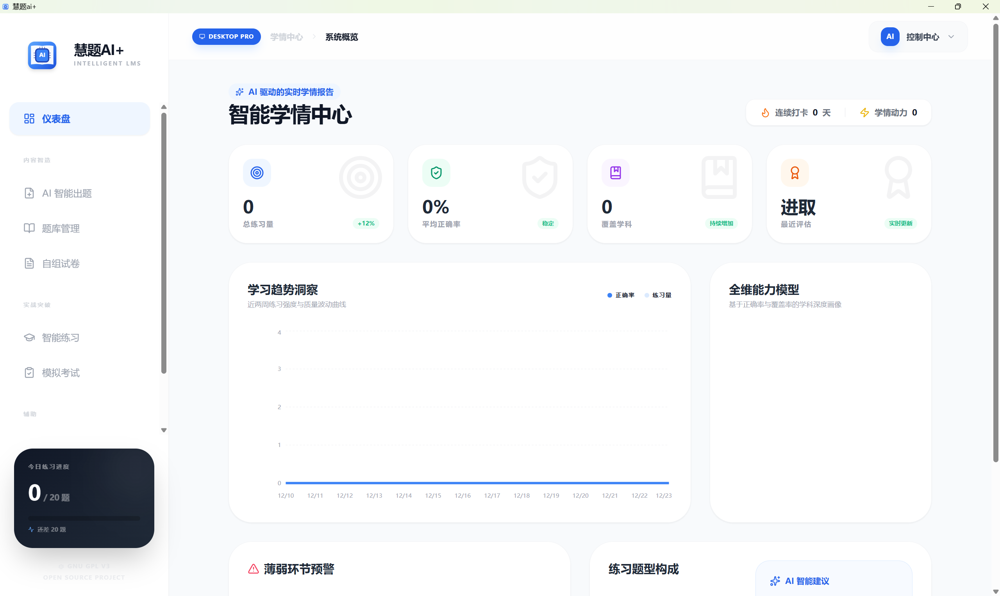

# 慧题AI+ (Huiti AI+)
下一代智能学术题库管理系统 —— AI 驱动知识闭环，让学习更高效、更专业。

 

## 🌟 软件简介
慧题AI+ 是一款专为学生等终身学习人群打造的高级学术辅助工具。它深度集成顶级大语言模型（如 Google Gemini 3、字节跳动豆包、DeepSeek 等），实现了从**原始资料**到**深度解析题库**的一键转换。无论是期末复习、考研备考还是职业认证，慧题AI+ 都能通过 AI 算法为您定制专属的练习体验。

## 🚀 核心功能
### AI 智能一键出题 (Magic Generator)
- **多格式支持**：支持直接上传 PDF、Word (Docx) 或 TXT 资料。
- **语义理解**：AI 自动阅读资料并精准提取核心知识点，自动生成单选题、判断题、填空题及简答题。
- **深度解析**：每道题目均附带超过 50 字的逻辑分析，帮助您“知其然更知其所以然”。

### 智能学情看板 (Intelligence Dashboard)
- **多维能力模型**：基于正确率与知识覆盖率生成学科雷达图。
- **薄弱项预警**：系统自动识别您的盲点科目并发出预警，建议针对性练习。
- **动力曲线**：实时追踪您的学习强度与进步轨迹，量化学习成果。

### 专业自组试卷 & PDF 导出 (Exam Builder)
- **所见即所得**：自由挑选题库中的题目，自定义试卷标题与规格。
- **全真排版**：支持导出符合 A4 标准的专业 PDF 试卷。
- **附带答案页**：导出文件包含标准试卷格式与详尽的参考答案页，方便纸质化自测。

### 沉浸式模拟考场 (Mock Exam)
- **全真限时模拟**：倒计时系统营造真实的考场压力。
- **AI 深度阅卷**：即使是主观简答题，AI 也能根据标准答案给出语义级评分与反馈。

### 灵活的 AI 引擎配置 (Model Settings)
- **多模型切换**：支持 Google Gemini、豆包 (Ark)、DeepSeek、ChatGPT 等多种主流 AI 供应商。
- **参数自定义**：可调节推理温度 (Temperature) 与 Top P 值，平衡出题的严谨性与创造力。

## 🛡️ 隐私与安全
- **100% 本地存储**：所有题库、练习历史和试卷均存储在浏览器 LocalStorage 中，不设云端服务器。
- **无账号体系**：无需注册，开箱即用，从物理层面隔离数据泄露风险。
- **全量备份**：提供一键导出 JSON 备份功能，方便在不同设备间迁移数据（备份文件包含所有用户数据，建议妥善保管，导出地址为用户的下载目录）。

## 📦 安装与运行
### Web 版
1. 访问项目部署地址（需替换为实际地址）。
2. 进入**模型配置**页面，填入您的 AI 服务 API Key。
3. 开始导入资料或手动录题，体验 AI 出题功能。

### 桌面专业版 (Tauri)
1. **手动编译部署**：
   ```bash
   # 克隆项目
   git clone <项目仓库地址>
   cd Huiti_AI_PlusV1.0

   # 安装前端依赖
   npm install

   # 前端打包
   npm run build

   # 编译 Tauri 桌面端
   npx tauri build
   ```
2. **直接安装**：
   下载项目产出的 `Huiti_AI_Plus_1.0.0_x64-setup.exe` 安装包，双击运行并按照向导完成安装。
3. 运行软件后，享受更稳定的性能与系统级资源访问能力。

## ⚠️ 编译注意事项
1. **Rust 编译环境**：需提前安装 Rust 工具链与 Tauri 依赖（如 Microsoft Visual C++ 构建工具）。
2. **NSIS 打包**：需安装 NSIS 工具并配置到系统环境变量，确保 Tauri 能调用 `makensis` 命令。

## ☕ 支持与致谢
慧题AI+ 是一个开源的学术提效项目。如果您觉得它提升了您的学习效率，欢迎在**关于系统**页面为开发者请喝一杯咖啡。

> “让 AI 成为您的私人助教，让知识从此触手可及。” —— 慧题AI+

## 📄 许可证声明
本项目采用 **GNU 通用公共许可证第 3 版（GPLv3）** 进行开源授权。详细协议条款请查阅项目根目录下的 `LICENSE` 文件。

**作者**：Quaron